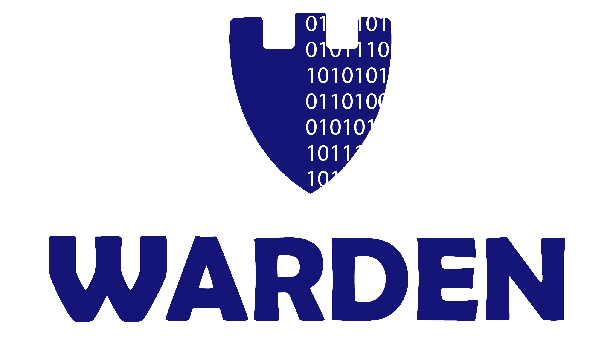
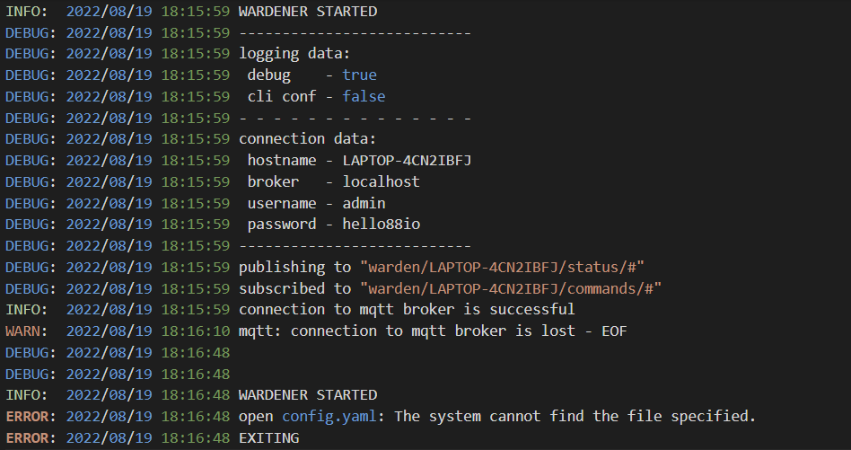

A simple background service that remotely controls Windows over MQTT.

**Table of Contents**

- [Features](#features)
  - [Layout](#layout)
- [Requirements](#requirements)
- [Running](#running)
- [Configuration](#configuration)
  - [config.yaml](#config.yaml)
  - [CLI](#cli)
- [Logging](#logging)
- [Supported messages](#supported-messages)
  - [Status](#status)
  - [Commands](#commands)
- [Building](#building)
- [Future](#future)
- [Alternativies](#alternativies)
- [Release notes](#release-notes)
- [License](#license)

## Features

- Control
  - Mute/Unmute system
  - Change volume level
  - Reboot system
  - Shutdown system
- Publishing of current volume status
- Works as a background process, so no pop-up windows and no need in nircmd
- Pretty easy configuration and installation
- Configuration validation and full debug
- Autoreconnection to MQTT Broker
- Command-line interface

### Layout

```tree
├── .github
├── .gitignore
├── README.md
├── go.mod
├── go.sum
├── main.go
├── docs
│   └── README.md
├── control
│   ├── power
│   │   └── power.go
│   └── sound
│       └── sound.go
├── tools
│   ├── configurator
│   │   └── configurator.go
│   └── logger
│       └── logger.go
├── mosquitto
│   ├── mosquitto.go
│   │  
│   └── sensors.go
└── configs
    └── config.yaml
```

A brief description of the layout:

- `README.md` is a detailed description of the project.
- `go.mod` is a detailed reference manual for module system in this project.
- `go.sum` is a detailed file of the checksum of direct and indirect dependency required by the module.
- `main.go` is main file of programm.
- `docs` contains project documentations.
- `control` contains main packages for interaction with Win 10 API, each subdirectory of `control` is a main package.
- `mosquitto` contains mqtt logic package.
- `tools` contains yaml `configurator` and `logger` packages.
- `configs` contains example of config.yaml file.

## Requirements

If you use binary file:

- `Windows 10`

If you use source code:

- `Windows 10`
- `Go 1.18 or greater`

## Running

Download either GO or EXE file from [Releases page](https://github.com/tiredsosha/warden/releases) and execute it:

    go run main.go
    main.exe

## Configuration

Configuration parameters must be placed in configuration files in the working directory from where you launch Warden.

<table>
<tr><th>Property</th><th>Description</th><th>Example</th>
<tr><td>broker</td><td>URL of the MQTT broker</td><td>127.0.0.1</td></tr>
<tr><td>username</td><td>Username  to MQTT broker</td><td>admin</td></tr>
<tr><td>password</td><td>Password to MQTT broker</td><td>password</td></tr>
</table>

### config.yaml

Warden will look for this file in the current working directory (directory from where you launched Warden). Create **config.yaml** file and put desired parameters into it. Or just copy an example of this file from config folder in the repo.

Example file:

    broker: 127.0.0.1
    username: admin
    password: password

### CLI

CLI have the same parametres as config file plus one added and if you forget one of params Warden will use default one.

<table>
<tr><th>Property</th><th>Description</th><th>Flag</th><th>Default</th>
<tr><td>cli</td><td>CLI status</td><td>c</td><td>none</td></tr>
<tr><td>broker</td><td>URL of the MQTT broker</td><td>b</td><td>localhost</td></tr>
<tr><td>username</td><td>Username to MQTT broker</td><td>u</td><td>admin</td></tr>
<tr><td>password</td><td>Password to MQTT broker</td><td>p</td><td>admin</td></tr>
</table>

(!!!)You must use cli flag if you using this interface(!!!)

Example:

    warden.exe -c -b 192.168.1.1 -u sasha -p password

## Logging

Warden starts logging immediately after launch. It makes **warden.log** file in the current working directory.  


## Supported messages

The payload of all messages is either raw string or a valid JSON element (possibly a primitive, like a single integer).

Example valid message payloads:

- `0`
- `100`
- `true`
- `test string`

### Status

- `PC_HOSTNAME` [is system name of your Windows pc](https://docs.microsoft.com/en-us/windows-server/administration/windows-commands/hostname).

---

**Topic:** warden/PC_HOSTNAME/status/online<br>
**Payload:** bool<br>
**Persistent:** yes<br>

true - alive, false - dead.

---

**Topic:** warden/PC_HOSTNAME/status/volume<br>
**Payload:** int in range 0-100<br>
**Persistent:** no<br>

Send current master volume status every 5 seconds.

---

### Commands

- `PC_HOSTNAME` [is system name of your Windows pc](https://docs.microsoft.com/en-us/windows-server/administration/windows-commands/hostname).

---

**Topic:** warden/PC_HOSTNAME/commands/shutdown<br>
**Payload:** -

Trigger immediate system shutdown.

---

**Topic:** warden/PC_HOSTNAME/commands/reboot<br>
**Payload:** -

Trigger immediate system reboot.

---

**Topic:** warden/PC_HOSTNAME/commands/volume<br>
**Payload:** int in range 0-100<br>

Trigger changes master volume of system.

---

**Topic:** warden/PC_HOSTNAME/commands/mute<br>
**Payload:** boolean

"true" - trigger mutes system volume. "false" - trigger unmutes system volume.

---

## Building

You can build it by yourself.

    go build -o bin/warden.exe -ldflags "-H windowsgui"

## Future

I will gladly add new stuff, if anyone will request!

## Alternativies

- [IOT Link](https://iotlink.gitlab.io/)
- [Winthing](https://github.com/msiedlarek/winthing) **Winthing is no longer actively maintained.**

## Release notes

[Changelog](./docs/release-notes.md)

## License

Copyright 2022 Alexandra Chichko &lt;tiredsosha@gmail.com&gt;

Licensed under the Apache License, Version 2.0 (the "License");
you may not use this software except in compliance with the License.
You may obtain a copy of the License at

> http://www.apache.org/licenses/LICENSE-2.0

Unless required by applicable law or agreed to in writing, software
distributed under the License is distributed on an "AS IS" BASIS,
WITHOUT WARRANTIES OR CONDITIONS OF ANY KIND, either express or implied.
See the License for the specific language governing permissions and
limitations under the License.
